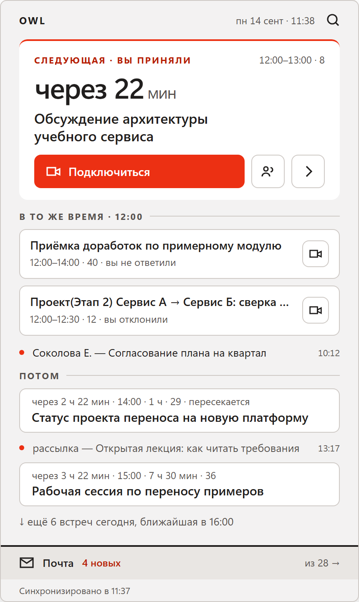
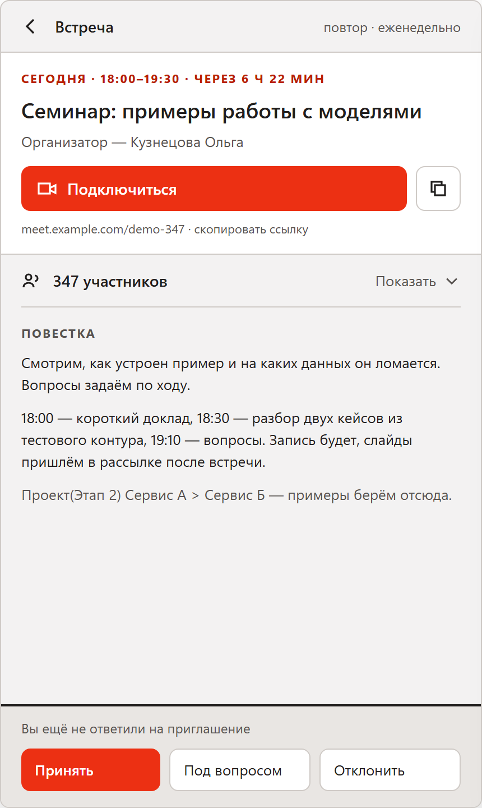
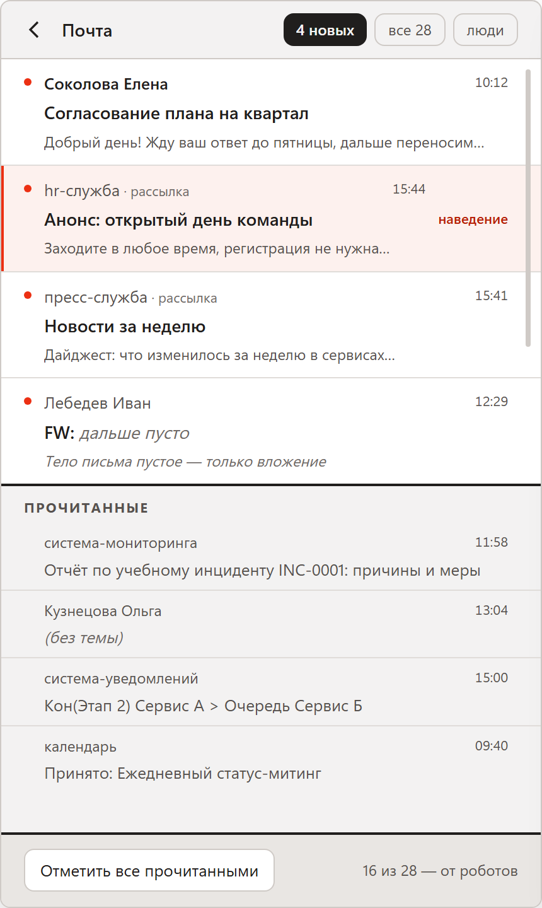
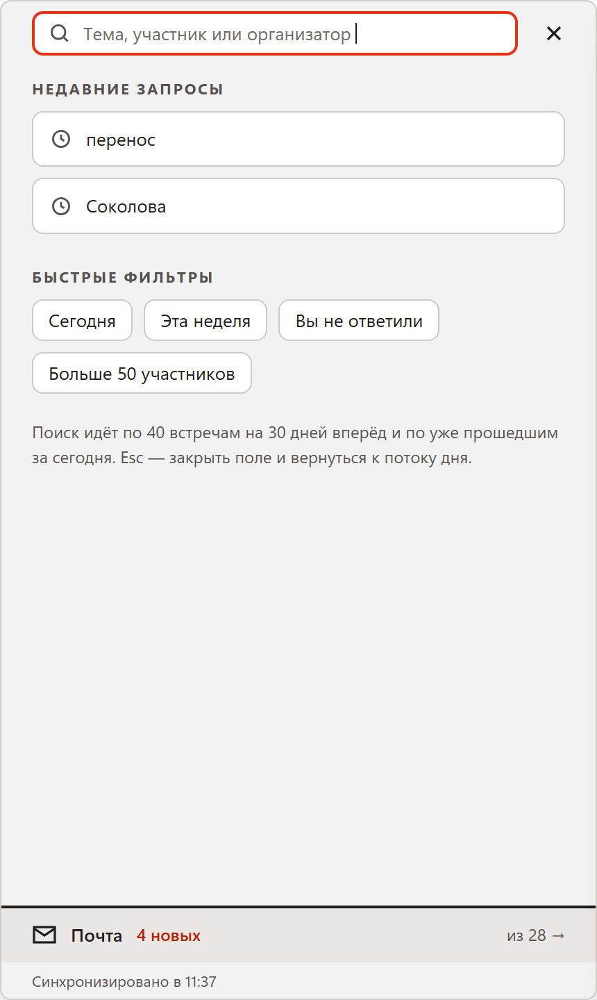
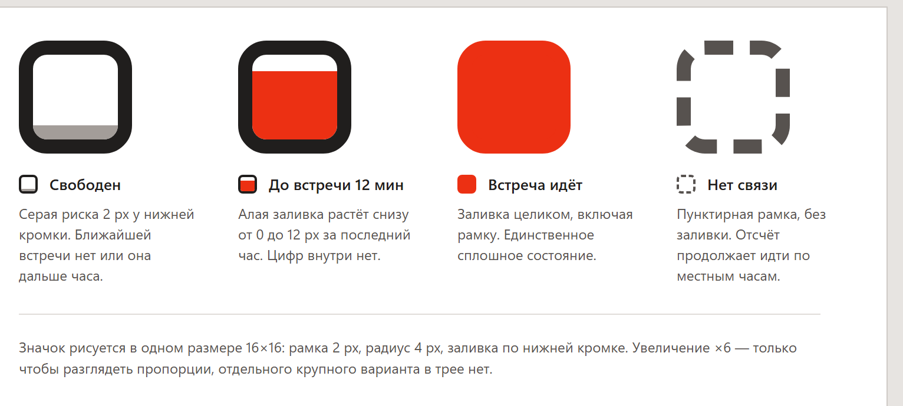
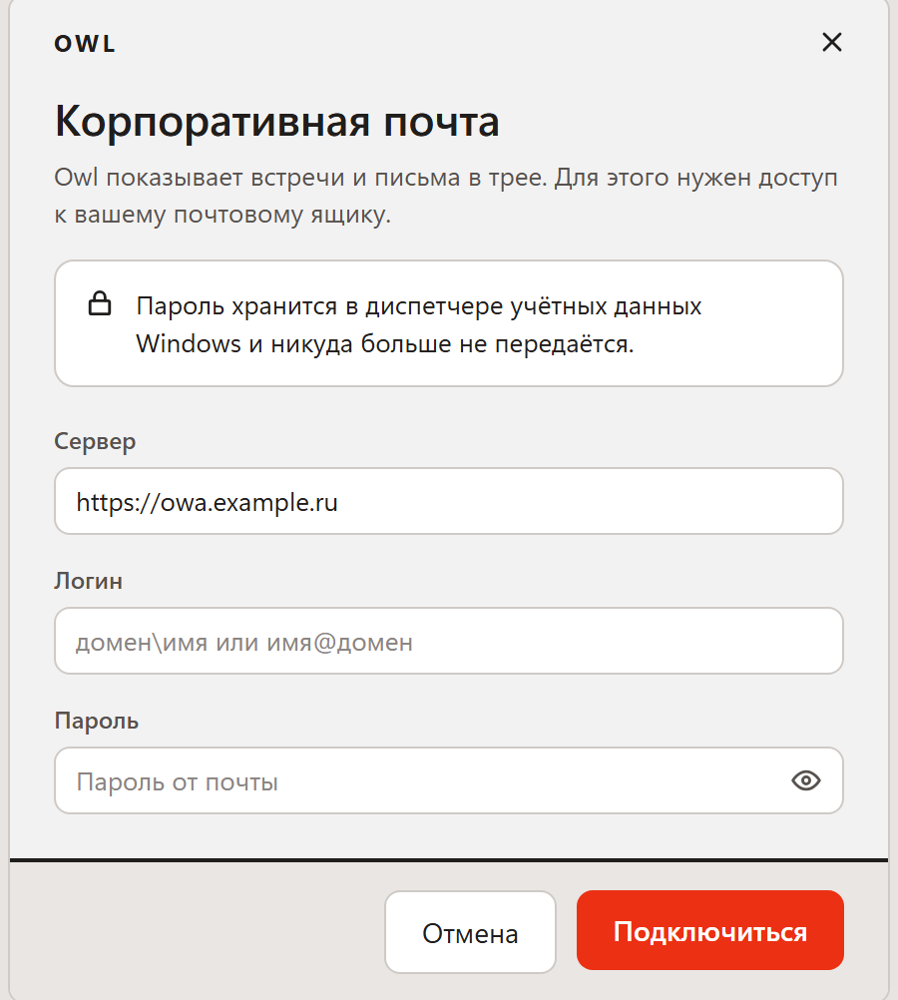

# Owl

Ближайшая встреча и непрочитанная почта — в системном трее Windows. Окно всплывает из правого нижнего угла, закрывается при потере фокуса и не просит переключаться на себя.



[](https://github.com/zagvladimir88/Owl-Companion/actions/workflows/build.yml)

## Зачем

Чтобы узнать, через сколько минут следующая встреча, обычно приходится открывать почтовый клиент и искать ответ среди писем, чатов и вкладок. Owl отвечает на этот вопрос, не открывая ничего: отсчёт нарисован прямо внутри иконки 16×16 в трее, а по клику разворачивается день целиком — встречи и почта в одном потоке.

Приложение работает с любым сервером Exchange, где включён ActiveSync. Протокол реализован в проекте с нуля, без Outlook, Graph API и установленного почтового клиента.

## Возможности

| | |
|---|---|
|  | **Карточка встречи.** Повестка, ссылка на звонок, участники (список свёрнут по умолчанию — в реальных встречах их бывает под сотню) и ответ на приглашение: принять, под вопросом, отклонить. |
|  | **Почта.** Непрочитанные сверху, рассылки и письма от систем отделены от писем людей. Открывается полное тело письма, а не превью. |
|  | **Поиск.** По теме и организатору, с быстрыми фильтрами и группировкой по дням. Ищет в загруженном окне календаря и почты — офлайн в том числе. |

### Иконка в трее

Windows не рисует подпись рядом с иконкой, поэтому весь отсчёт помещается внутрь значка. Счётчик писем уступает место встрече, когда она близко.



Точные значения — минуты, число писем, текст ошибки — уходят в подсказку при наведении.

## Установка

Скачайте `Owl-win-Setup.exe` из [последнего релиза](https://github.com/zagvladimir88/Owl-Companion/releases/latest) и запустите. Установщик не требует прав администратора и ставит приложение в профиль пользователя.

Установщик не подписан сертификатом, поэтому при первом запуске Windows покажет SmartScreen: «Подробнее» → «Выполнить в любом случае».

Дальше приложение обновляется само: проверяет релизы репозитория и докачивает только разницу между версиями. Кто предпочитает без установки — в релизе лежит `Owl-win-Portable.zip`, но такая копия не обновляется.

## Первый запуск



Нужны три вещи: адрес сервера, доменный логин и пароль от почты.

Пароль сохраняется в диспетчере учётных данных Windows под именем `OwaWidget:<хост>` и не покидает машину. Приложение не отправляет данные никуда, кроме вашего почтового сервера.

## Где что лежит

Каталог `%LOCALAPPDATA%\OwaWidget`:

| Файл | Что внутри |
|---|---|
| `settings.json` | Настройки: сервер, логин, напоминания, тихие часы, игнор-лист отправителей |
| `state.json` | Идентификатор устройства и ключи синхронизации EAS — состояние диалога с сервером |
| `widget.log` | Лог с ротацией по 1 МБ. Первое место, куда стоит заглянуть при проблемах |

## Настройки

Правятся в `settings.json` или из меню приложения:

| Параметр | По умолчанию | Смысл |
|---|---|---|
| `ReminderMinutes` | `5` | За сколько минут напомнить о встрече |
| `RespectAppointmentReminder` | `true` | Использовать напоминание, заданное в самой встрече, вместо общего |
| `QuietHoursEnabled` / `QuietFromHour` / `QuietToHour` | `false` / `22` / `8` | Тихие часы: уведомления о почте молчат |
| `BurstThreshold` / `BurstWindowSeconds` | `3` / `60` | Защита от лавины: пачка писем сворачивается в одно уведомление |
| `IgnoredSenders` | пусто | Отправители, о письмах которых не уведомлять |
| `StartWithWindows` | `false` | Автозапуск через ярлык в автозагрузке |
| `MailFilterType` / `CalendarFilterType` | `3` / `5` | Глубина синхронизации — значения `FilterType` протокола EAS |

## Как устроено

```
src/OwaWidget.App    WPF-приложение: окно, трей, уведомления, кэш, обновления
src/OwaWidget.Eas    Клиент Exchange ActiveSync 14.1 — свой WBXML, без внешних зависимостей
tools/OwaWidget.Probe Консольная утилита: проверить, что сервер отвечает и учётные данные верны
```

Внутри `OwaWidget.Eas` — кодек WBXML (двоичный XML, на котором говорит ActiveSync), команды `Provision`, `FolderSync`, `Sync`, `Ping`, `ItemOperations`, `MeetingResponse`, парсеры писем и календаря и разворачивание повторяющихся встреч в конкретные даты.

Новые письма приходят не опросом, а командой `Ping`: соединение висит открытым, пока сервер сам не сообщит об изменениях. Между запусками встречи и письма читаются из кэша на диске, поэтому окно открывается заполненным даже без сети.

### Диагностика подключения

Если приложение не входит, проще всего проверить сервер отдельно:

```
dotnet run --project tools/OwaWidget.Probe -- домен\логин
```

Утилита последовательно выполняет `OPTIONS`, `FolderSync` и `Sync` и печатает, на каком шаге всё ломается. Адрес сервера переопределяется переменной `OWA_SERVER`.

## Сборка

Нужен .NET 9 SDK и Windows 10 версии 1809 или новее.

```
git clone https://github.com/zagvladimir88/Owl-Companion.git
cd Owl-Companion
dotnet build OwaWidget.sln -c Release
```

Сборка каждого pull request выкладывается артефактом на странице запуска CI — её можно скачать и запустить, не собирая у себя.

### Выпуск версии

```
git tag v1.0.1
git push origin v1.0.1
```

Дальше всё делает `release.yml`: собирает self-contained сборку, упаковывает установщик и дельту к предыдущей версии через Velopack и публикует релиз с заметками о накопившихся изменениях.

## Технические рамки

Окно фиксированное, 430×720, без полноэкранного режима и горизонтальной прокрутки. Тема одна и не подстраивается под системную. Шрифт — только системный Segoe UI Variable. Всё это не временные упрощения, а ограничения, из которых вырос дизайн: виджет обязан читаться мгновенно и исчезать, как только перестал быть нужен.

---

Изображения выше — макеты интерфейса. Все имена, темы встреч и письма в них вымышленные.